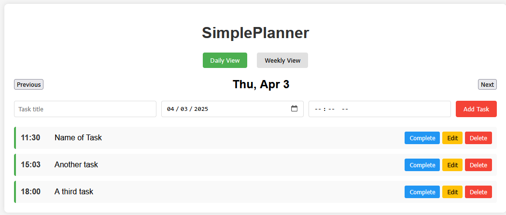

## 1. Run the following in cmd (or download zip):
### `git clone https://github.com/itsvaxx/simple-planner.git`

## 2. In the project directory, install dependencies:
### `npm install`
Make sure you have [Node.js](https://nodejs.org/) installed.

## 3. Then you can run:
### `npm start`

Open [http://localhost:3000](http://localhost:3000) to view it in your browser.

The page will automatically reload when you make changes.

